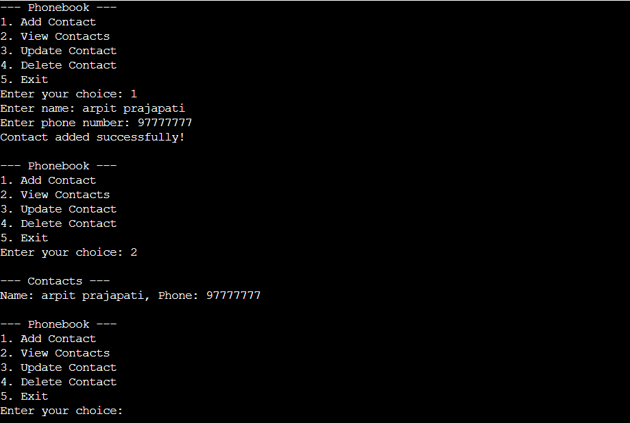

# Simple Phonebook Database

A simple C application to manage a phonebook database with basic CRUD (Create, Read, Update, Delete) functionality.Contact data is stored in a binary file using file handling.

## OUTPUT:


## Features
- Add a new contact (name and phone number)
- View all contacts
- Update an existing contact
- Delete a contact
- Persistent storage using a binary file (`phonebook.dat`)

## How to Run

1. Clone this repository:
   ```bash
   git clone https://github.com/GET-UNKNOWN-ERR0R/simple-phonebook.git

2. Navigate to Folder:
   ```bash
   cd simple-phonebook
3. Compile the program using GCC:
   ```bash
   gcc phonebook.c -o phonebook
4. Run the program:
   ```bash
   ./phonebook

## Result

   --- Phonebook ---
1. Add Contact
2. View Contacts
3. Update Contact
4. Delete Contact
5. Exit
Enter your choice: 1
Enter name: Arpit Prajapati
Enter phone number: 123456789
Contact added successfully!

--- Phonebook ---
1. Add Contact
2. View Contacts
3. Update Contact
4. Delete Contact
5. Exit
Enter your choice: 2
--- Contacts ---
Name: Arpit Prajapati, Phone: 123456789

# License


   
